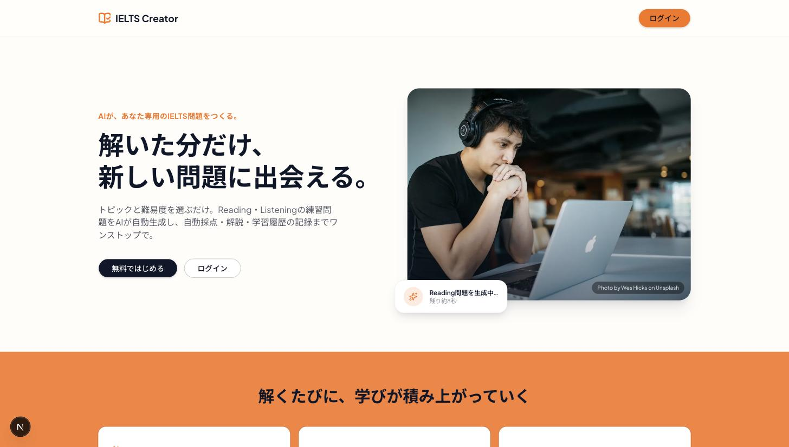
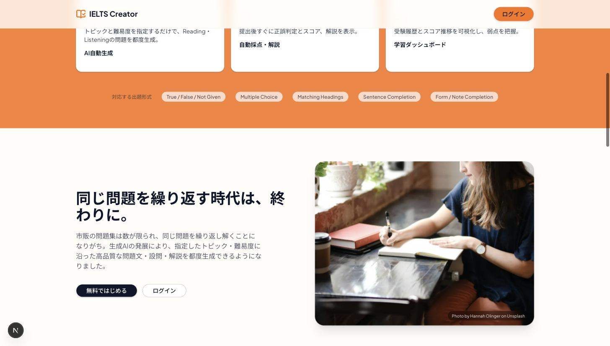
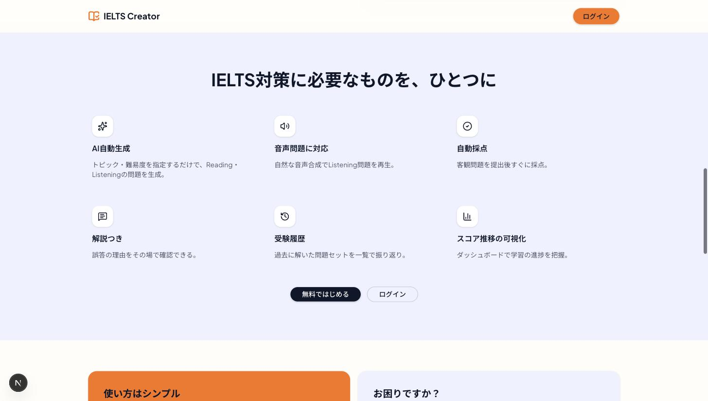
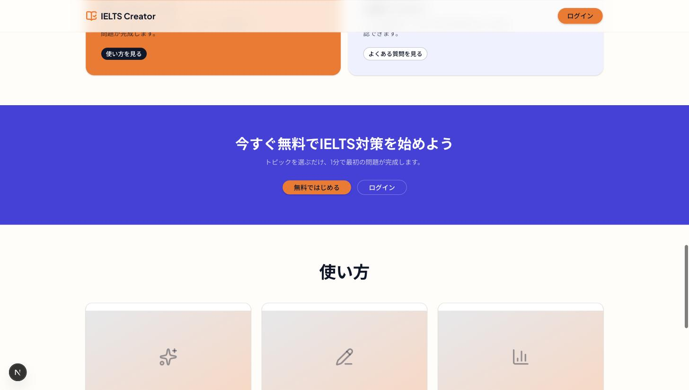
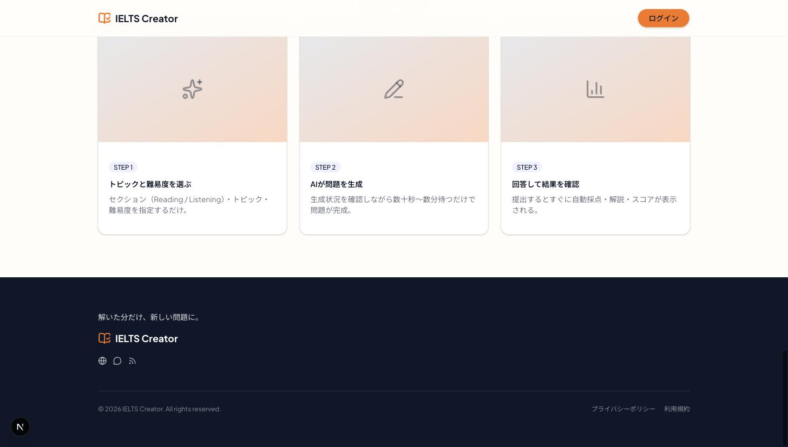

# S-01 Top画面

- 更新日: 2026-08-09
- 関連文書: [画面一覧](../画面一覧.md) / [画面遷移図（ielts-createrリポジトリ、完成イメージのスクリーンショット掲載）](https://github.com/h-fujiwara-dev/ielts-creater/blob/main/docs/画面遷移図.md) / [ielts-createrリポジトリ tickets/00005 TOP画面のFigmaデザイン作成](https://github.com/h-fujiwara-dev/ielts-creater/blob/main/tickets/00005_TOP画面のFigmaデザイン作成.md)

## 画面概要

サービス概要を紹介し、ログイン／サインアップ画面（S-02）へ誘導する、ログイン不要の入口画面。アプリ未認知のユーザーが最初に到達し、サービスの価値提案（トピック・難易度を指定した問題の自動生成、自動採点、学習ダッシュボード）を伝える役割を持つ。

ビジュアルデザインは#00005で検討し確定した。当初Figma上で構成要素を直接組み立てる案を試みたが、質感の作り込みに限界があったため方針転換し、参考にしていたFigma Community「Top 16 Websites of 2024 - Awwwards」内のcertosoftware.com再現フレームをレイアウト構成・配色トーンの参考にしつつ、Next.js + TypeScript + Tailwind CSS + shadcn/uiで直接コード実装した上でIELTS Creator向けの内容に差し替えている（詳細は#00005参照）。ロゴ・コピー・写真等の実在企業のブランド要素は使用していない。最終デザインの一次情報は本ファイルのスクリーンショット（下記「ワイヤーフレーム」）とする。Figmaファイルは方向性検討の過程で使用したのみで、最終デザインの反映は行っていない。

## ビジュアルデザイン

### カラー

| 用途 | カラー | 備考 |
| --- | --- | --- |
| ネイビー（基調色・見出し・本文） | `#0F172A` | ボタンhover等は`#1E293B` |
| オレンジ（アクセント・主要CTA） | `#F97316` | |
| ブルー（CTAバンド背景） | `#4640DE` | |
| ラベンダー（機能グリッド背景） | `#EEF1FF` | |
| クリーム（ベース背景） | `#FFFDF9` | |

### タイポグラフィ

- 見出し・本文: **Plus Jakarta Sans**（Latin）+ **Noto Sans JP**（日本語）を`next/font/google`で読み込み、レイアウトシフトなしで自己ホスト

### 画像

- ヒーロー・ストーリーセクションの写真はUnsplash APIから取得した実写真を使用（クレジット表記をページ内に明記、Unsplash APIガイドラインに従いダウンロードイベントをトリガー済み）
  - ヒーロー: Photo by [Wes Hicks](https://unsplash.com/@sickhews) on Unsplash
  - ストーリー: Photo by [Hannah Olinger](https://unsplash.com/@hannaholinger) on Unsplash

## 画面構成要素

上から順に、以下9ブロックで構成する。

| # | 要素 | 内容 |
| --- | --- | --- |
| 1 | ヘッダー | ロゴ「IELTS Creator」＋ログインボタン。スクロール追従（sticky）＋背景ぼかし |
| 2 | ヒーロー | アイキャッチ文「AIが、あなた専用のIELTS問題をつくる。」＋見出し「解いた分だけ、新しい問題に出会える。」＋説明文＋CTA2種（無料ではじめる／ログイン）＋実写真＋生成中を示す浮遊ステータスカード |
| 3 | ハイライト＋対応出題形式 | 「AI自動生成／自動採点・解説／学習ダッシュボード」の3カード＋対応出題形式バッジ（True/False/Not Given、Multiple Choice、Matching Headings、Sentence Completion、Form/Note Completion） |
| 4 | ストーリー | 「同じ問題を繰り返す時代は、終わりに。」の訴求文＋実写真 |
| 5 | 機能グリッド | AI自動生成／音声問題対応／自動採点／解説つき／受験履歴／スコア推移の可視化（6項目、アイコン付き）＋CTA |
| 6 | 2カラムCTA | 「使い方はシンプル」（使い方を見る）／「お困りですか？」（よくある質問を見る） |
| 7 | CTAバンド | 「今すぐ無料でIELTS対策を始めよう」＋CTA2種 |
| 8 | 使い方（3ステップ） | STEP1 トピックと難易度を選ぶ／STEP2 AIが問題を生成／STEP3 回答して結果を確認 |
| 9 | フッター | タグライン「解いた分だけ、新しい問題に。」＋ロゴ＋SNSアイコン＋コピーライト＋利用規約・プライバシーポリシー |

ヘッダーの「機能／使い方／よくある質問」ナビリンクおよびフッターのサイト内リンク集・ニュースレター登録は、リンク先ページが存在しない段階では実体のないUIになるため、Phase 1では設置しない方針とした（各セクションへのCTAボタンでS-02への導線のみを提供する）。

## ワイヤーフレーム（最終デザイン スクリーンショット）

実装済みプロトタイプ（Next.js、デスクトップ幅1440px）のスクリーンショット。上から順に該当ブロック。

1. ヘッダー＋ヒーロー
   
2. ハイライト＋対応出題形式／ストーリー
   
3. 機能グリッド
   
4. 2カラムCTA／CTAバンド／使い方
   
5. 使い方（続き）／フッター
   

モバイル幅（375px）でも横スクロールなしで表示崩れがないことを確認済み。

## 入力項目とバリデーション

フォーム入力は持たない。ユーザー操作はCTAボタンのクリックのみ。

## 状態・画面遷移

| 操作/状態 | 遷移先 | 条件・備考 |
| --- | --- | --- |
| CTA（無料ではじめる／ログイン）押下 | S-02 ログイン／サインアップ画面 | 常時遷移可能（未ログイン前提） |

- ログイン済みユーザーがTop画面へアクセスした場合の挙動（S-03等へ自動リダイレクトするか、Top画面をそのまま表示するか）は業務要件定義書・システム要件定義書に明記がない。**MVPでは自動リダイレクトを行わず常にTop画面を表示する**ことを暫定方針とする（要件が明確化され次第本節を更新する）

## API/データ連携

認証不要の静的コンテンツのみで構成され、バックエンドAPIの呼び出しはない。

## 実装メモ

- ルーティングは`app/page.tsx`（ルート直下）を想定する
- UIコンポーネントは shadcn/ui（Base UIプリセット）+ Tailwind CSSを想定。ボタン等クリック可能要素には`cursor-pointer`を明示し、ホバーは`scale`変形を避けて色・シャドウ変化＋150–250msの`transition`で統一する（`prefers-reduced-motion`を尊重）
- ヒーロー・ストーリーの写真は本番実装時にUnsplash APIキーを別途払い出し、`next/image`の`sizes`指定・クレジット表記を含めて実装する
- 検証用プロトタイプ一式（`landing-clone`）は本チケット内の一時的な確認用実装であり、そのままこのリポジトリには取り込まない。本ファイルの内容・スクリーンショットを一次情報として実装する
