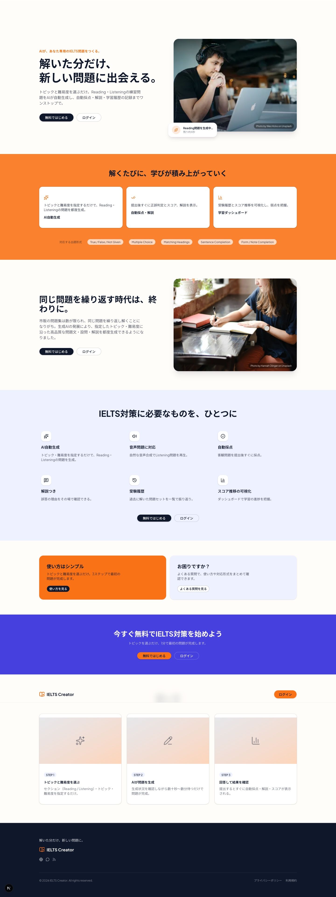

# S-01 Top画面

- 更新日: 2026-09-02（TOPページの3Dインタラクティブ化全面刷新〔#00074〕を反映。旧演出〔#00066〕・視認性改善〔#00068〕は本改修で置き換え）
- 関連文書: [画面一覧](../画面一覧.md) / [画面遷移図（ielts-createrリポジトリ、完成イメージのスクリーンショット掲載）](https://github.com/h-fujiwara-dev/ielts-creater/blob/main/docs/画面遷移図.md) / [ielts-createrリポジトリ tickets/00005 TOP画面のFigmaデザイン作成](https://github.com/h-fujiwara-dev/ielts-creater/blob/main/tickets/00005_TOP画面のFigmaデザイン作成.md) / [ielts-createrリポジトリ tickets/00074 TOPページの3Dインタラクティブ化全面刷新](https://github.com/h-fujiwara-dev/ielts-creater/blob/main/tickets/00074_TOPページの3Dインタラクティブ化全面刷新.md) / [S-08 プライバシーポリシー画面](./S-08_プライバシーポリシー画面.md) / [S-09 利用規約画面](./S-09_利用規約画面.md)

## 画面概要

サービス概要を紹介し、ログイン／サインアップ画面（S-02）へ誘導する、ログイン不要の入口画面。アプリ未認知のユーザーが最初に到達し、サービスの価値提案（トピック・難易度を指定した問題の自動生成、自動採点、学習ダッシュボード）を伝える役割を持つ。

ビジュアルデザインは#00005で検討し確定した。当初Figma上で構成要素を直接組み立てる案を試みたが、質感の作り込みに限界があったため方針転換し、参考にしていたFigma Community「Top 16 Websites of 2024 - Awwwards」内のcertosoftware.com再現フレームをレイアウト構成・配色トーンの参考にしつつ、Next.js + TypeScript + Tailwind CSS + shadcn/uiで直接コード実装した上でIELTS Creator向けの内容に差し替えている（詳細は#00005参照）。ロゴ・コピー・写真等の実在企業のブランド要素は使用していない。最終デザインの一次情報は本ファイルのスクリーンショット（下記「ワイヤーフレーム」）とする。Figmaファイルは方向性検討の過程で使用したのみで、最終デザインの反映は行っていない。

## ビジュアルデザイン

### カラー

トークン自体は変更せず、ダッシュボード等の認証後画面と共通のブランドトークンを使う。#00074で「ヒーロー・フッターをダーク背景、その他セクションはライト背景」というブックエンド構成に変更した。

| 用途 | カラー | 備考 |
| --- | --- | --- |
| ネイビー（基調色・見出し・本文／ヒーロー・フッター背景） | `#0F172A` | ボタンhover等は`#1E293B` |
| オレンジ（アクセント・主要CTA） | `#F97316` | |
| ブルー（CTAバンド背景） | `#4640DE` | |
| ラベンダー（機能グリッドのカードアクセント） | `#EEF1FF` | #00074でセクション全面塗りからカード単位のアクセントに変更 |
| クリーム（ベース背景） | `#FFFDF9` | |

### タイポグラフィ

- 見出し・本文: **Geist**（Latin）+ **Zen Kaku Gothic New**（日本語）を`next/font/google`で読み込み、レイアウトシフトなしで自己ホスト（#00074でPlus Jakarta Sans + Noto Sans JPから変更。ルートlayoutでの定義のためS-02〜S-07にも適用される）
- 数値表現（使い方セクションのステップ番号等）: 既存の**Geist Mono**を「技術的な仕様書」らしいテクスチャとして活用

### 画像

- ストーリーセクションの写真はUnsplash APIから取得した実写真を使用（クレジット表記をページ内に明記、Unsplash APIガイドラインに従いダウンロードイベントをトリガー済み）
  - ストーリー: Photo by [Hannah Olinger](https://unsplash.com/@hannaholinger) on Unsplash
- ヒーローのストック写真は#00074で廃止し、3Dシーン（下記参照）に置き換えた

### 3Dビジュアル: Headphones + Book（ヒーロー背景）

IELTS Creatorが実際に提供する2機能（Reading・Listeningの練習問題生成）を、React Three Fiberによる2つの3Dオブジェクト（ヘッドホン＝Listening、見開きの本＝Reading）でそのまま表現する。#00066のWebGLメッシュグラデーション（`GradientMesh`）・カーソル反応パーティクル（`DotField`）を起点に、社内レビューで「バンドスコアの階段」「スコアゲージ/ダイヤル」の2案を検討・実装した上で、最終的に製品説明として最も直接的なこの構成に落ち着いた（詳細は[#00074](https://github.com/h-fujiwara-dev/ielts-creater/blob/main/tickets/00074_TOPページの3Dインタラクティブ化全面刷新.md)参照）。

- **ヘッドホン**: `torusGeometry`（`arc=Math.PI`の半トーラス）によるヘッドバンド＋左右のイヤーカップ（`meshPhysicalMaterial`、navy寄りガラス質）。各カップにブランドオレンジのクッションリングをアクセントとして配置
- **本**: 背表紙を挟んで左右の「ページ」が扇状に開く見開き本。各ページは独立した回転ピボットの`<group>`で背表紙からヒンジさせる構造。ページはクリーム色のマット素材（`meshStandardMaterial`）でヘッドホンのガラス質と対比させ、ページ上に細いバーで印字された文章を示唆する
- GSAP `ScrollTrigger`（Hero到達時に一度）でヘッドホン→本の順にわずかにstaggerさせたスケールアップ演出（`back.out`イージング）、カーソル追従パララックス（タッチデバイスでは無効化）、`Float`による控えめなアイドルアニメーションを実装。オブジェクト自体の連続回転（ターンテーブル演出）は、回転に伴い本が真横を向く・ヘッドホンのクッションリングが不自然に見える等、可読性を損なう角度が周期的に現れたため見送った
- `prefers-reduced-motion`またはWebGL2非対応環境では、3DシーンのJSチャンク自体をロードせず、静的SVGのヘッドホン＋本のラインアート（`HeroSceneFallback`）にフォールバックする
- 実行中にWebGLコンテキストロスト（`webglcontextlost`）が発生した場合も同じ静的フォールバックに切り替える保険を実装。実機（`npm run dev`）検証で、React Strict Modeのdev専用二重マウント（mount→unmount→remount）によりHeroの`<Canvas>`が確実にコンテキストロストする不具合を確認したため、`next.config.ts`で`reactStrictMode: false`に設定して解消した（本番ビルドではStrict Modeの二重invoke自体が発生しないため、この設定変更による本番挙動への影響はない）。GPU負荷軽減のため`@react-three/postprocessing`（`EffectComposer`+`Bloom`）は導入していない
- 実装は`src/components/three/`配下（`hero-visual-scene.tsx` / `hero-scene.tsx` / `hero-scene-fallback.tsx`）

## 画面構成要素

上から順に、以下10ブロックで構成する。

| # | 要素 | 内容 |
| --- | --- | --- |
| 1 | ヘッダー | ロゴ「IELTS Creator」＋ログインボタン。スクロール追従（sticky）＋背景ぼかし。ヒーロー（ダーク背景）表示中は透過ダーク配色、スクロールして通過後はライト配色に切り替わる |
| 2 | ヒーロー | ダークネイビー背景に3Dシーン「Headphones + Book」（下記参照）を敷き、アイキャッチ文「AIが、あなた専用のIELTS問題をつくる。」＋見出し「解いた分だけ、新しい問題に出会える。」＋説明文＋CTA3種（無料ではじめる／ログイン／ゲストとして始める、「無料ではじめる」はカーソル追従のマグネット演出付き）＋生成中を示す浮遊ステータスカード |
| 3 | ハイライト＋対応出題形式 | 「AI自動生成／自動採点・解説／学習ダッシュボード」の3カード＋対応出題形式バッジ（True/False/Not Given、Multiple Choice、Matching Headings、Sentence Completion、Form/Note Completion） |
| 4 | ストーリー | 「同じ問題を繰り返す時代は、終わりに。」の訴求文＋実写真 |
| 5 | 機能グリッド | AI自動生成／音声問題対応／自動採点／解説つき／受験履歴／スコア推移の可視化（6項目、アイコン付き）＋CTA。非対称2カラムスパンのBento Grid配置とし、各カードはホバー時にスポットライト効果＋3Dチルトが付く（SpotlightCard）。GSAP `ScrollTrigger.batch()`による同期スタガー演出（`prefers-reduced-motion`時は個別`RevealOnScroll`にフォールバック） |
| 6 | 2カラムCTA | 「使い方はシンプル」（使い方を見る）／「お困りですか？」（よくある質問を見る） |
| 7 | CTAバンド | 「今すぐ無料でIELTS対策を始めよう」＋CTA2種 |
| 8 | 使い方（3ステップ） | STEP1 トピックと難易度を選ぶ／STEP2 AIが問題を生成／STEP3 回答して結果を確認。各カード上部にGeist Monoの数字ウォーターマーク（01/02/03）を配置し、「技術的な仕様書」らしいテクスチャを演出する |
| 9 | Powered byマーキー | 採用技術（Next.js、React、TypeScript、Tailwind CSS、Three.js、GSAP、OpenAI、Vercel）のロゴを横スクロールでアピールする帯。`prefers-reduced-motion`時は静的な折り返し表示に切り替える |
| 10 | フッター | タグライン「解いた分だけ、新しい問題に。」＋ヒーローのHeadphones+Bookを想起させる小さなアイコンペア＋ロゴ＋コピーライト＋[プライバシーポリシー（S-08）](./S-08_プライバシーポリシー画面.md)・[利用規約（S-09）](./S-09_利用規約画面.md)へのリンク |

ヘッダーの「機能／使い方／よくある質問」ナビリンクおよびフッターのサイト内リンク集・ニュースレター登録は、リンク先ページが存在しない段階では実体のないUIになるため、Phase 1では設置しない方針とした（各セクションへのCTAボタンでS-02への導線のみを提供する）。一方でフッターのプライバシーポリシー・利用規約リンクは、[#00008](https://github.com/h-fujiwara-dev/ielts-creater/blob/main/tickets/00008_プライバシーポリシー利用規約画面の追加.md)でS-08/S-09の機能仕様・本文案が確定済みのため、実装時は実際のリンク先として設置する。

上記2・5・9のビジュアル演出は[#00066](https://github.com/h-fujiwara-dev/ielts-creater/blob/main/tickets/00066_TOPページビジュアル演出のモダン化.md)で追加し、[#00068](https://github.com/h-fujiwara-dev/ielts-creater/blob/main/tickets/00068_TOPページHero演出の視認性改善.md)で視認性を調整した後、[#00074](https://github.com/h-fujiwara-dev/ielts-creater/blob/main/tickets/00074_TOPページの3Dインタラクティブ化全面刷新.md)で「追加npm依存ゼロ・自前実装」方針を撤廃し、three.js（React Three Fiber）・GSAP等の実践的なライブラリを用いた本格的な3D/インタラクティブ表現へ全面刷新した。Heroの3Dビジュアル自体は#00074の中でさらに「バンドスコアの階段」→「スコアゲージ/ダイヤル」→「Headphones + Book」の順に3回イテレーションしており、現在の実装は最後のHeadphones + Bookである。

## ワイヤーフレーム（最終デザイン スクリーンショット）

実装済みプロトタイプ（Next.js、デスクトップ幅1440px）のフルページスクリーンショット。

> **注**: この画像は#00074（3Dインタラクティブ化全面刷新）以前の状態のままです。Headphones + Bookの3D描画自体はPlaywrightによる実機相当の検証（`document.visibilityState === "visible"`な状態でのレンダリング確認）で正常動作を確認済みですが、フルページスクリーンショットの自動取得（IntersectionObserver/ScrollTriggerが素通しのスクロールでは発火しづらい）技術的制約により、この画像アセット自体はまだ差し替えていません。次回の目視確認時に更新してください。

モバイル幅（375px）でも横スクロールなしで表示崩れがないことを確認済み（#00066時点。#00074のレイアウト変更差分は同様のTailwindブレークポイント構成を踏襲しているが、実機での再確認を推奨）。

## 入力項目とバリデーション

フォーム入力は持たない。ユーザー操作はCTAボタンのクリックのみ。

## 状態・画面遷移

| 操作/状態 | 遷移先 | 条件・備考 |
| --- | --- | --- |
| CTA「無料ではじめる」押下 | S-02 ログイン／サインアップ画面（`/login?step=signup`） | Cognito Hosted UIのサインアップ画面へ直接誘導するprovider `cognito-signup`を使う（[#00062](https://github.com/h-fujiwara-dev/ielts-creater/blob/main/tickets/00062_TOP画面ボタンでCognitoサインイン-サインアップ画面を出し分け.md)） |
| CTA「ログイン」押下 | S-02 ログイン／サインアップ画面（`/login`） | Cognito Hosted UIのログイン画面へ誘導するprovider `cognito`を使う |
| CTA「ゲストとして始める」押下（#00056） | S-07 ダッシュボード画面 | S-02を経由せず、共有デモアカウントで自動ログインしてから直接遷移する。`GuestSignInButton`が`signIn("guest", { callbackUrl: "/dashboard" })`を呼ぶ |

- ログイン済みユーザーがTop画面へアクセスした場合の挙動（S-03等へ自動リダイレクトするか、Top画面をそのまま表示するか）は業務要件定義書・システム要件定義書に明記がない。**MVPでは自動リダイレクトを行わず常にTop画面を表示する**ことを暫定方針とする（要件が明確化され次第本節を更新する）

## API/データ連携

認証不要の静的コンテンツのみで構成され、バックエンドAPIの呼び出しはない。

## 実装メモ

- ルーティングは`app/page.tsx`（ルート直下）を想定する
- UIコンポーネントは shadcn/ui（Base UIプリセット）+ Tailwind CSSを想定。ボタン等クリック可能要素には`cursor-pointer`を明示し、ホバーは`scale`変形を避けて色・シャドウ変化＋150–250msの`transition`で統一する（`prefers-reduced-motion`を尊重）
- 検証用プロトタイプ一式（`landing-clone`）は本チケット内の一時的な確認用実装であり、そのままこのリポジトリには取り込まない。本ファイルの内容・スクリーンショットを一次情報として実装する
- フッターのプライバシーポリシー・利用規約リンクは[#00008](https://github.com/h-fujiwara-dev/ielts-creater/blob/main/tickets/00008_プライバシーポリシー利用規約画面の追加.md)で機能仕様・本文案を確定した（[S-08](./S-08_プライバシーポリシー画面.md) / [S-09](./S-09_利用規約画面.md)）。実際のページ実装は別途対応する
