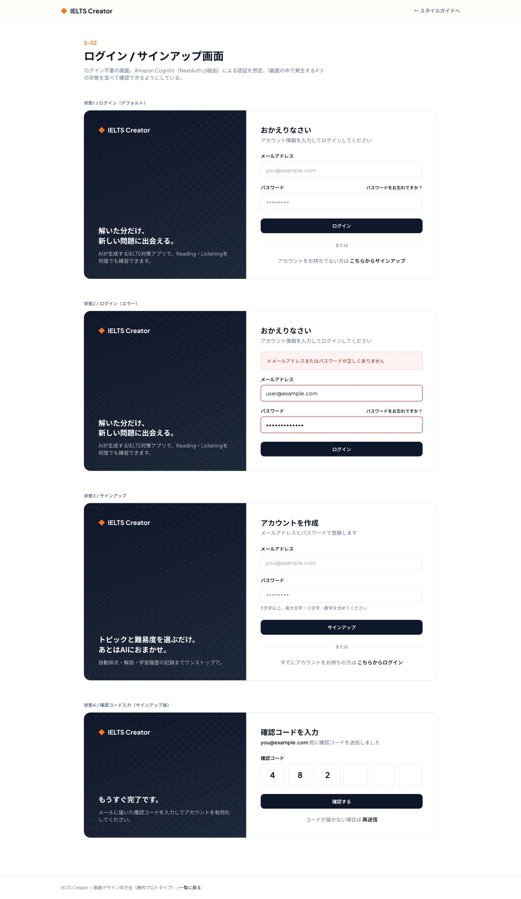

# S-02 ログイン／サインアップ画面

- 更新日: 2026-08-11（#00034でログイン方式をCognito Hosted UIリダイレクトに確定。カスタムフォームUIの実装は廃止し、以下のワイヤーフレーム・画面構成要素は#00016時点のデザイン検討時の記録として残す）
- 関連文書: [画面一覧](../画面一覧.md) / [画面遷移図（ielts-createrリポジトリ）](https://github.com/h-fujiwara-dev/ielts-creater/blob/main/docs/画面遷移図.md) / [backendリポジトリ docs/API一覧.md（3章 認証フロー）](https://github.com/h-fujiwara-dev/ielts-creater-backend/blob/main/docs/API一覧.md#3-認証フロー) / [ielts-createrリポジトリ tickets/00016 画面デザイン叩き台の作成](https://github.com/h-fujiwara-dev/ielts-creater/blob/main/tickets/00016_画面デザイン叩き台の作成（ベーススタイル・主要フロー6画面）.md)

## 画面概要

ログイン・サインアップ（アカウント登録）を行う、ログイン不要の画面。Top画面（S-01）のCTAから遷移する。認証基盤はAmazon Cognito（User Pool）で、フロントエンドはNextAuth.jsのCognitoプロバイダ経由でAuthorization Code + PKCEフローによりログインする。

ビジュアルデザインは[#00016](https://github.com/h-fujiwara-dev/ielts-creater/blob/main/tickets/00016_画面デザイン叩き台の作成（ベーススタイル・主要フロー6画面）.md)で検討し確定した。TOP画面（S-01、#00005）で確定した配色・フォントを継承しつつ、本画面はログイン不要の独立画面であるためTOPのマーケティング用ヘッダーは使用しない。

## ビジュアルデザイン

### カラー・タイポグラフィ

TOP画面（S-01）と共通のトークンを使用する。ネイビー`#0F172A`（基調色）・オレンジ`#F97316`（アクセント）・Plus Jakarta Sans + Noto Sans JP。加えて、フォーム検証・状態表示のためのセマンティックカラー（success `#15803D` / warning `#B45309` / error `#B91C1C`）を本チケットで新規に定義し、全画面で共通利用する。

### レイアウト

左にブランドパネル（ネイビーのグラデーション＋ドット柄の装飾、キャッチコピー）、右にフォームを配置する2カラム構成。780px未満ではブランドパネルを非表示にし、フォームのみの1カラムに切り替える。

- ログインフォーム: メールアドレス／パスワード入力＋パスワード再設定リンク＋サインアップへの導線
- サインアップフォーム: メールアドレス／パスワード入力（パスワードポリシーのヒント表示）
- 確認コード入力フォーム: 6桁の分割入力欄＋再送信リンク
- エラー時: フォーム上部に赤系のアラートを表示し、該当する入力欄を赤枠で強調

## 画面構成要素

| 要素 | 内容 |
| --- | --- |
| ログインフォーム | メールアドレス入力、パスワード入力、ログインボタン |
| サインアップ導線 | ログインフォームからサインアップフォームへの切り替えリンク |
| サインアップフォーム | メールアドレス入力、パスワード入力、サインアップボタン |
| 確認コード入力フォーム | サインアップ後に表示。Cognitoから送付される確認コードの入力欄、確認ボタン |
| パスワード再設定導線 | パスワードを忘れた場合の再設定フローへのリンク |

## ワイヤーフレーム（デザイン叩き台 スクリーンショット）

静的HTML叩き台（デスクトップ幅1440px）のフルページスクリーンショット。ログイン／エラー／サインアップ／確認コード入力の4状態を1ページに並べて確認できるようにしている。

モバイル幅（375px相当）でも横スクロールなしで表示崩れがないことを確認済み（780px未満でブランドパネルを非表示にし1カラム化）。

## 入力項目とバリデーション

| 項目 | 種別 | 必須 | バリデーション |
| --- | --- | --- | --- |
| メールアドレス | テキスト | 必須 | メール形式であること |
| パスワード（ログイン） | パスワード | 必須 | - |
| パスワード（サインアップ） | パスワード | 必須 | Cognitoパスワードポリシーに準拠（具体的な文字数・文字種要件は[infraリポジトリ](https://github.com/h-fujiwara-dev/ielts-creater-infra)のUser Pool設定に従う） |
| 確認コード | テキスト | 必須（サインアップ時） | Cognitoから送付される確認コードと一致すること |

## 状態・画面遷移

| 操作/状態 | 遷移先・表示 | 条件・備考 |
| --- | --- | --- |
| ログイン成功 | S-07 ダッシュボード画面 | Cognitoからのトークン取得後、初回は`GET /api/v1/me`でユーザー情報を自動プロビジョニング |
| ログイン失敗 | 同一画面にエラー表示 | メールアドレス／パスワード不一致、未確認アカウント等 |
| サインアップ送信成功 | 確認コード入力フォーム表示 | Cognitoが確認コードをメール送付 |
| 確認コード検証成功 | ログインフォーム表示 | 自動ログインは行わず、ユーザーに再度ログイン操作を促す |
| 確認コード検証失敗 | 同一画面にエラー表示 | コード不一致・期限切れ等 |
| 未ログイン状態で保護ページへ直接アクセス | 本画面へリダイレクト | `middleware.ts`が`(protected)`配下へのアクセスを検知した場合 |

## API/データ連携

| 連携先 | 用途 | 備考 |
| --- | --- | --- |
| Amazon Cognito（NextAuth.js経由） | ログイン・サインアップ・確認コード検証・パスワード再設定 | Authorization Code + PKCE。バックエンドAPIを介さずCognitoと直接やり取りする |
| `GET /api/v1/me` | ログイン後のユーザー情報取得・自動プロビジョニング確認 | [API設計書](https://github.com/h-fujiwara-dev/ielts-creater-backend/blob/main/docs/API設計書/GET_me.md) |

## 認証連携（フロントエンド側）実装方針

バックエンドを含めた認証フロー全体のシーケンス図は[backendリポジトリ docs/API一覧.md](https://github.com/h-fujiwara-dev/ielts-creater-backend/blob/main/docs/API一覧.md#3-認証フロー)にある。本節はフロントエンド（Next.js）側の実装方針のみを扱う。

### 構成要素

- **NextAuth.js**: Cognitoプロバイダを設定し、Authorization Code + PKCEフローでログインを行う
- **セッション保存**: 取得したAccess Token / ID TokenはhttpOnly・暗号化Cookieに保存する（クライアントJSからは読み取れない）
- **保護ルート**: `middleware.ts`で未ログイン時に`(protected)`配下へのアクセスを`(auth)/login`へリダイレクトする
- **API呼び出し**: `lib/api/client.ts`がセッションからAccess Tokenを取り出し、`Authorization: Bearer <AccessToken>`ヘッダーを付与してbackend APIを呼び出す

### 実装メモ（#00034で確定・実装済み）

- Cognito App ClientはTerraform（[infraリポジトリ](https://github.com/h-fujiwara-dev/ielts-creater-infra) `terraform/modules/cognito`）でconfidential clientとして構築される
- next-authのCognitoプロバイダはOAuth Authorization Code + PKCEの仕様上Hosted UIへのリダイレクトが必須となるため、上記「画面構成要素」「入力項目とバリデーション」に記載のメールアドレス／パスワード直接入力フォームは実装しない。`(auth)/login`は「Cognitoでログイン」ボタン（`CognitoSignInButton`）のみを表示し、ログイン・サインアップ・確認コード入力はすべてCognito Hosted UI側の画面で行う
- ログアウトは`GET /api/auth/cognito-logout`（Route Handler）経由で行う。NextAuthのローカルセッション破棄（サーバー側`signOut({ redirect: false })`）に加えて、Cognito Hosted UIのグローバルログアウトエンドポイント（`https://<domain>/logout?client_id=...&logout_uri=...`）へリダイレクトし、Cognito側のセッションもあわせて終了させる（#00041で対応）
- フロントエンドはPhase 1（ローカル開発）・Phase 2（本実装）を問わず、常にCognito Hosted UIリダイレクトによるログインが必須である。以前はPhase 1（`app.auth.mode: no-auth`）向けに固定devユーザーで認証をスキップするdev-user/mock-session機構を用意していたが、#00034でのHosted UIログイン実装置き換えに伴い削除した。ローカル開発時も実際にCognito User Poolへログインする必要がある（[ielts-createrリポジトリ docs/ロードマップ.md](https://github.com/h-fujiwara-dev/ielts-creater/blob/main/docs/ロードマップ.md)参照）
