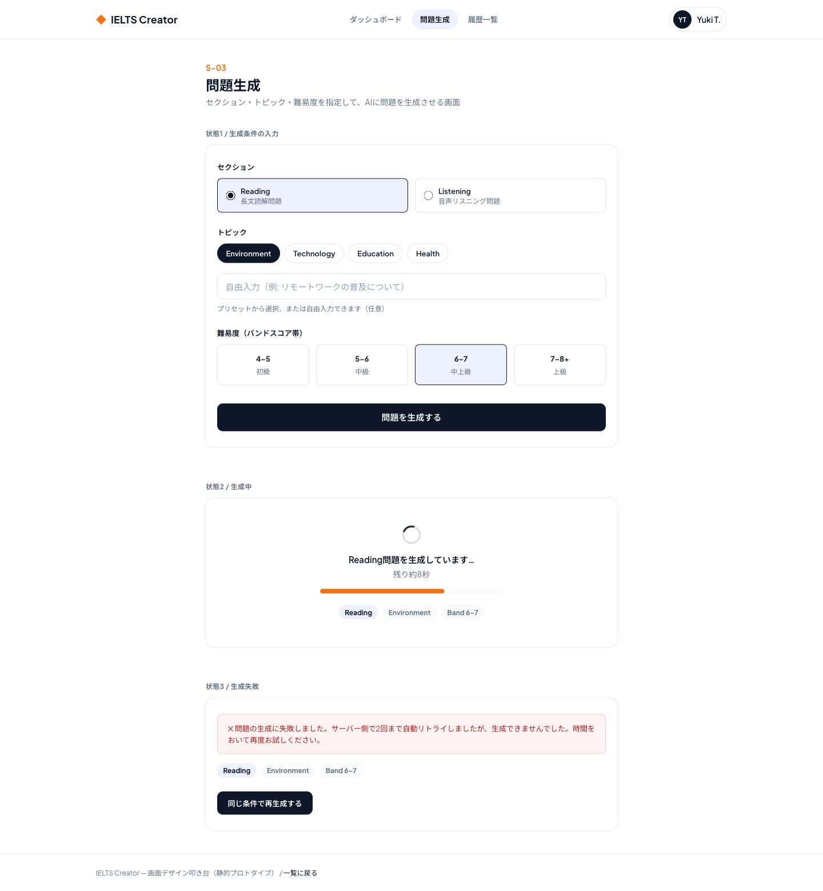

# S-03 問題生成画面

- 更新日: 2026-08-10（AI連携方針の確定に合わせリトライ回数の記述を修正し、1日の生成回数上限到達時のエラー表示を追加）
- 関連文書: [画面一覧](../画面一覧.md) / [backendリポジトリ docs/API設計書/POST_question-sets.md](https://github.com/h-fujiwara-dev/ielts-creater-backend/blob/main/docs/API設計書/POST_question-sets.md) / [ielts-createrリポジトリ tickets/00016 画面デザイン叩き台の作成](https://github.com/h-fujiwara-dev/ielts-creater/blob/main/tickets/00016_画面デザイン叩き台の作成（ベーススタイル・主要フロー6画面）.md)

## 画面概要

セクション・トピック・難易度を指定して問題生成を開始する画面。ログイン必須。ダッシュボード画面（S-07）から遷移して到達し、生成完了後は回答画面（S-04）へ遷移する。

ビジュアルデザインは[#00016](https://github.com/h-fujiwara-dev/ielts-creater/blob/main/tickets/00016_画面デザイン叩き台の作成（ベーススタイル・主要フロー6画面）.md)で検討し確定した。ログイン後の画面（S-03/S-04/S-05/S-06/S-07）共通の「アプリナビゲーションシェル」（ロゴ＋ダッシュボード/問題生成/履歴一覧のナビリンク＋ユーザーメニュー）を上部に配置する。

## ビジュアルデザイン

### レイアウト

中央寄せ1カラムのカード形式。

- セクション選択: Reading/Listeningを大きめのラジオカード（アイコン代わりの説明文付き）で選択
- トピック: プリセットのchip（Environment/Technology/Education/Health）＋自由入力欄
- 難易度: Band帯を4枚のカード（4–5/5–6/6–7/7–8+）で選択、選択中はラベンダー背景＋ネイビー枠で強調
- 生成開始ボタン: ネイビー塗りの大サイズボタンをカード下部に配置
- 生成中状態: スピナー＋進捗バー＋残り時間の目安、選択条件をバッジで表示
- 失敗状態: 赤系アラートで理由を明示し、同条件での再生成ボタンを表示

## 画面構成要素

| 要素 | 内容 |
| --- | --- |
| セクション選択 | Reading / Listening のいずれかを選択するUI（ラジオボタン等） |
| トピック入力/選択 | 自由入力欄、またはプリセット（Environment, Technology, Education, Health等）からの選択UI |
| 難易度選択 | バンドスコア帯（Band 4-5 / 5-6 / 6-7 / 7-8+）のプルダウンまたは選択UI |
| 生成開始ボタン | 上記条件で生成をリクエストする |
| 生成中インジケーター | 生成中（202 Accepted後、ポーリング中）であることを示すローディング表示 |
| エラー表示 | 生成失敗時のエラーメッセージと再生成導線／1日の生成回数上限到達時のエラーメッセージ（上限到達時は再生成導線を表示しない） |

## ワイヤーフレーム（デザイン叩き台 スクリーンショット）

静的HTML叩き台（デスクトップ幅1440px）のフルページスクリーンショット。入力／生成中／生成失敗の3状態を1ページに並べて確認できるようにしている。

モバイル幅（375px相当）でも横スクロールなしで表示崩れがないことを確認済み。

## 入力項目とバリデーション

| 項目 | 種別 | 必須 | バリデーション |
| --- | --- | --- | --- |
| セクション | 単一選択 | 必須 | `READING` / `LISTENING` のいずれか |
| トピック | テキスト or 単一選択 | 任意 | 自由入力の場合の文字数上限は100文字。未入力時の挙動は実装メモ参照 |
| 難易度 | 単一選択 | 必須 | `BAND_4_5` / `BAND_5_6` / `BAND_6_7` / `BAND_7_8_PLUS` のいずれか |

## 状態・画面遷移

| 操作/状態 | 遷移先・表示 | 条件・備考 |
| --- | --- | --- |
| 生成開始ボタン押下 | 生成中インジケーター表示 | `POST /api/v1/question-sets`を呼び出し202 Acceptedで`questionSetId`を取得 |
| 生成中（ポーリング） | 生成中インジケーター継続 | `GET /api/v1/question-sets/{id}`を一定間隔でポーリングし`status`を確認 |
| 生成完了（`status=READY`） | S-04 回答画面 | `/practice/{questionSetId}`へ遷移。受験（Attempt）の開始は回答画面側で行う（S-04参照） |
| 生成失敗（`status=FAILED`） | 同一画面にエラー表示 | サーバー側で1回リトライ済みの結果。「再生成」導線から同条件で`POST /api/v1/question-sets`を再送信する（F-12） |
| 生成回数上限到達（`RateLimitExceededException`, 429） | 同一画面にエラー表示（再生成導線なし） | ユーザーごとの1日2回上限に達した場合。翌日まで生成できない旨を明示する |

## API/データ連携

| API | 用途 | 備考 |
| --- | --- | --- |
| `POST /api/v1/question-sets` | 生成開始 | [API設計書](https://github.com/h-fujiwara-dev/ielts-creater-backend/blob/main/docs/API設計書/POST_question-sets.md) |
| `GET /api/v1/question-sets/{id}` | 生成ステータスのポーリング | [API設計書](https://github.com/h-fujiwara-dev/ielts-creater-backend/blob/main/docs/API設計書/GET_question-sets-id.md) |

## 実装メモ

- トピック未入力のまま生成開始ボタンを押下してよい（空文字送信を許可）。未入力時はbackend側でプリセット一覧からランダムに1件選択し、202レスポンスの`topic`に選択結果が返るため、生成中インジケーターにその値を表示する（[backend API設計書 POST_question-sets.md](https://github.com/h-fujiwara-dev/ielts-creater-backend/blob/main/docs/API設計書/POST_question-sets.md)参照）
- ポーリング間隔・タイムアウト時間は本書では規定しない（性能要件: Reading 15秒程度、Listening 30秒以内を目安に調整する）
