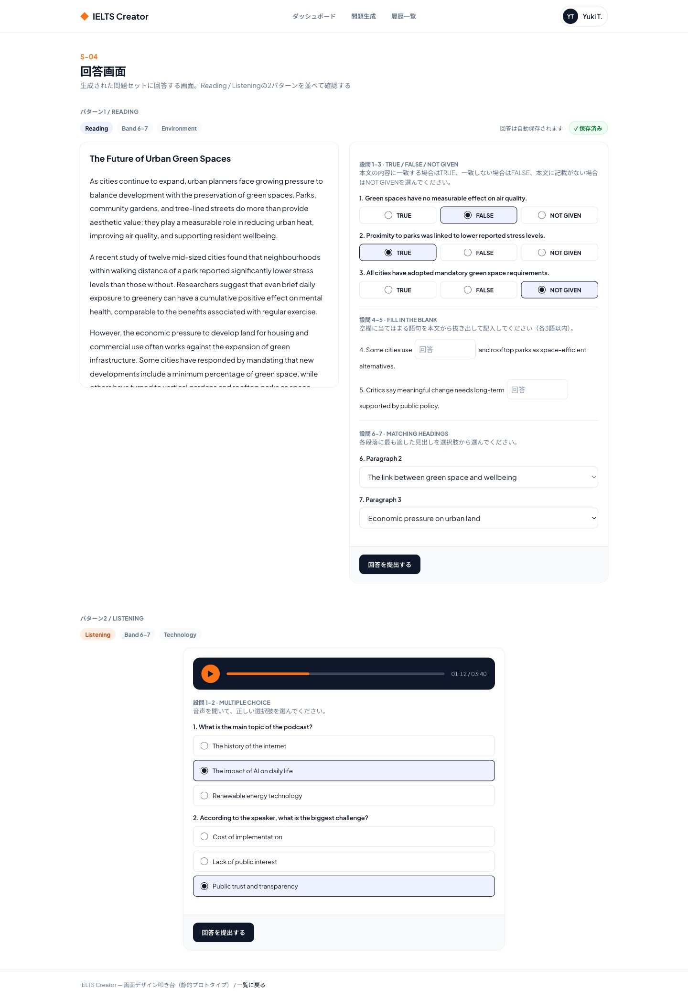

# S-04 回答画面

- 更新日: 2026-08-10（ビジュアルデザインを確定し反映）
- 関連文書: [画面一覧](../画面一覧.md) / [backendリポジトリ docs/API設計書/GET_question-sets-id.md](https://github.com/h-fujiwara-dev/ielts-creater-backend/blob/main/docs/API設計書/GET_question-sets-id.md) / [.../GET_question-sets-id-audio-segments.md](https://github.com/h-fujiwara-dev/ielts-creater-backend/blob/main/docs/API設計書/GET_question-sets-id-audio-segments.md) / [.../POST_attempts.md](https://github.com/h-fujiwara-dev/ielts-creater-backend/blob/main/docs/API設計書/POST_attempts.md) / [.../PATCH_attempts-id-answers.md](https://github.com/h-fujiwara-dev/ielts-creater-backend/blob/main/docs/API設計書/PATCH_attempts-id-answers.md) / [.../POST_attempts-id-submit.md](https://github.com/h-fujiwara-dev/ielts-creater-backend/blob/main/docs/API設計書/POST_attempts-id-submit.md) / [ielts-createrリポジトリ tickets/00016 画面デザイン叩き台の作成](https://github.com/h-fujiwara-dev/ielts-creater/blob/main/tickets/00016_画面デザイン叩き台の作成（ベーススタイル・主要フロー6画面）.md)

## 画面概要

生成された問題セット（Reading本文＋設問、またはListening音声＋設問）に回答する画面。ログイン必須。ルートは`/practice/{questionSetId}`。問題生成画面（S-03）での生成完了時、または履歴一覧画面（S-06）の「もう一度解く」ボタンからの2通りの到達経路がある。

ビジュアルデザインは[#00016](https://github.com/h-fujiwara-dev/ielts-creater/blob/main/tickets/00016_画面デザイン叩き台の作成（ベーススタイル・主要フロー6画面）.md)で検討し確定した。

## ビジュアルデザイン

### レイアウト

Reading・Listeningでレイアウトを分ける。

- **Reading**: 2カラム構成。左にパッセージ本文（スクロール可能なカード、最大高32rem）、右に設問グループを配置。TFNGは3択の横並びラジオ、Fill in the Blankは文中インライン入力欄、Matching Headingsはセレクトボックスで見出しを選択する
- **Listening**: 中央1カラム構成。上部にネイビー背景の音声プレイヤー（再生ボタン・シークバー・再生時間）、下部にMCQ設問（縦積みラジオ）を配置
- 共通: 上部に現在の受験条件（セクション／難易度／トピック）バッジと自動保存インジケーターを表示。提出ボタンはカード下部に固定配置

## 画面構成要素

| 要素 | 内容 |
| --- | --- |
| パッセージ本文表示（Reading） | 段落単位の本文テキスト |
| 音声プレイヤー（Listening） | `AudioPlayer.tsx`。複数の音声セグメントを1つの連続音声として再生、再生位置表示 |
| 設問グループ表示 | 出題形式ごとの指示文（`instructions`）と設問一覧 |
| 回答UI（設問形式ごと） | TFNG: ラジオボタン（True/False/Not Given） / MCQ: ラジオボタンまたはチェックボックス / FILL_BLANK・FORM/NOTE COMPLETION: テキスト入力 / MATCHING_HEADINGS: プルダウンまたはドラッグ&ドロップでの見出し選択 |
| 提出ボタン | 全設問の回答を確定し採点をリクエストする |

## ワイヤーフレーム（デザイン叩き台 スクリーンショット）

静的HTML叩き台（デスクトップ幅1440px）のフルページスクリーンショット。Reading（本文＋TFNG/穴埋め/見出しマッチング）・Listening（音声プレイヤー＋MCQ）の2パターンを1ページに並べて確認できるようにしている。

モバイル幅（375px相当）でも横スクロールなしで表示崩れがないことを確認済み（Readingの2カラムは1カラムに切り替え）。

## 入力項目とバリデーション

| 出題形式 | 入力UI | 必須 | バリデーション |
| --- | --- | --- | --- |
| TFNG | ラジオボタン | 任意（F-07: 未回答可） | `TRUE` / `FALSE` / `NOT_GIVEN` のいずれか |
| MCQ | ラジオボタン／チェックボックス | 任意 | 選択肢ラベルから選択（複数正解形式は複数選択可） |
| FILL_BLANK / FORM_COMPLETION / NOTE_COMPLETION | テキスト入力 | 任意 | 語数上限（`maxWords`、生成時にサーバー側で設定）を超える入力はクライアント側で警告表示を検討 |
| MATCHING_HEADINGS | プルダウン／ドラッグ&ドロップ | 任意 | 段落IDに対して見出し選択肢（ダミー選択肢を含む）から選択 |

全設問について未回答のまま提出可能（F-07）。未回答は採点時に不正解として扱われる。

## 状態・画面遷移

| 操作/状態 | 遷移先・表示 | 条件・備考 |
| --- | --- | --- |
| 画面初期表示 | 問題文/音声・設問を表示 | `GET /api/v1/question-sets/{id}`で問題内容を取得し、`POST /api/v1/attempts`で受験（Attempt）を開始して`attemptId`を取得する。S-03からの新規生成／S-06の「もう一度解く」による過去問題の再利用のいずれも、`questionSetId`を渡す点は同様 |
| 回答入力（都度） | 自動保存 | 入力の都度（デバウンス想定）`PATCH /api/v1/attempts/{id}/answers`を呼び出し部分保存する |
| 提出ボタン押下 | S-05 結果画面 | `POST /api/v1/attempts/{id}/submit`を呼び出し、レスポンス（スコア・正誤・解説）を保持したまま結果画面へ遷移する |

## API/データ連携

| API | 用途 | 備考 |
| --- | --- | --- |
| `GET /api/v1/question-sets/{id}` | 問題内容取得（正解は含まない） | [API設計書](https://github.com/h-fujiwara-dev/ielts-creater-backend/blob/main/docs/API設計書/GET_question-sets-id.md) |
| `GET /api/v1/question-sets/{id}/audio-segments` | Listening音声の署名付きURL取得 | [API設計書](https://github.com/h-fujiwara-dev/ielts-creater-backend/blob/main/docs/API設計書/GET_question-sets-id-audio-segments.md)。URL有効期限は15分程度のため、再生時に都度取得し直す想定 |
| `POST /api/v1/attempts` | 受験開始 | [API設計書](https://github.com/h-fujiwara-dev/ielts-creater-backend/blob/main/docs/API設計書/POST_attempts.md) |
| `PATCH /api/v1/attempts/{id}/answers` | 回答の部分保存 | [API設計書](https://github.com/h-fujiwara-dev/ielts-creater-backend/blob/main/docs/API設計書/PATCH_attempts-id-answers.md) |
| `POST /api/v1/attempts/{id}/submit` | 採点実行 | [API設計書](https://github.com/h-fujiwara-dev/ielts-creater-backend/blob/main/docs/API設計書/POST_attempts-id-submit.md) |

## 実装メモ

- Listeningの場合、音声セグメントは複数ファイルに分かれるが、ユーザーからは1つの連続音声として聞こえるようプレイヤー側で連続再生する
- **未決事項**: システム要件定義書F-07は「ページ再読み込み後も回答内容が復元される」ことを求めているが、現行のbackend API設計（`docs/API一覧.md`）には保存済み・未提出の回答を取得するGETエンドポイントが存在しない（`PATCH`は保存のみで204 No Contentを返す）。復元を実現するにはbackend側に受験途中の回答を取得するAPI（例: `GET /api/v1/attempts/{id}/answers`）の追加が必要になる可能性が高く、backendリポジトリ側での別チケット化を検討する
