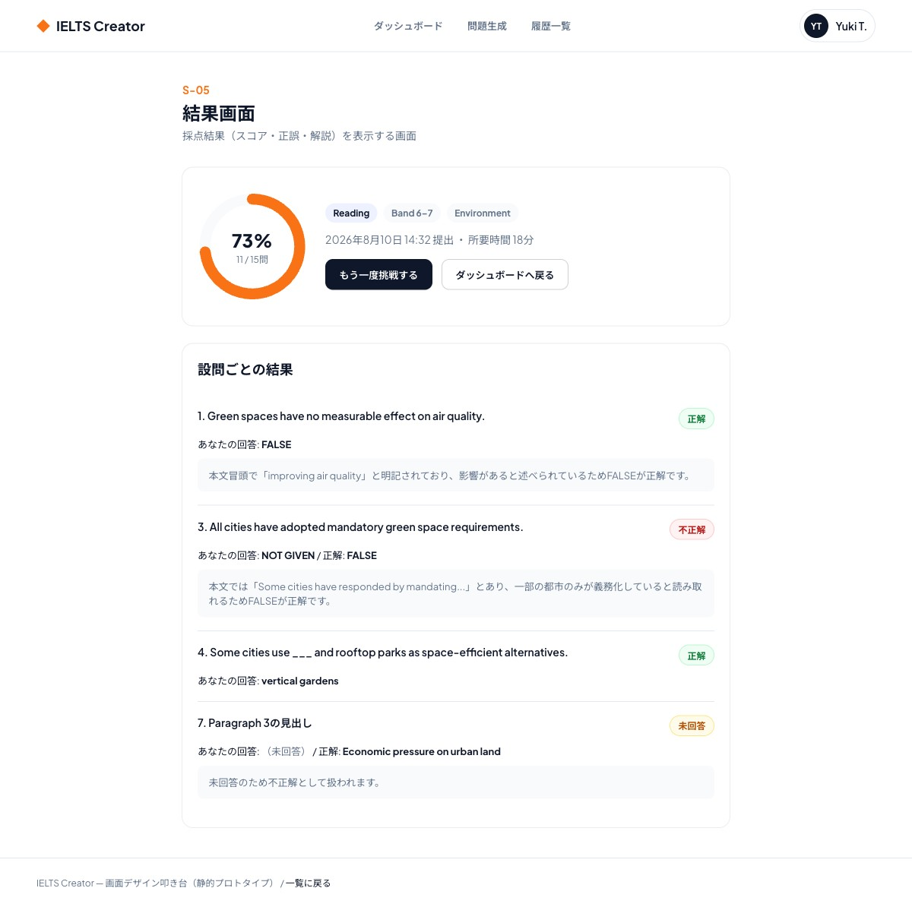

# S-05 結果画面

- 更新日: 2026-08-10（ビジュアルデザインを確定し反映、backend API設計の確定に伴い実装メモを更新）
- 関連文書: [画面一覧](../画面一覧.md) / [backendリポジトリ docs/API設計書/POST_attempts-id-submit.md](https://github.com/h-fujiwara-dev/ielts-creater-backend/blob/main/docs/API設計書/POST_attempts-id-submit.md) / [.../GET_attempts-id.md](https://github.com/h-fujiwara-dev/ielts-creater-backend/blob/main/docs/API設計書/GET_attempts-id.md) / [ielts-createrリポジトリ tickets/00016 画面デザイン叩き台の作成](https://github.com/h-fujiwara-dev/ielts-creater/blob/main/tickets/00016_画面デザイン叩き台の作成（ベーススタイル・主要フロー6画面）.md)

## 画面概要

採点結果（スコア・正誤・解説）を表示する画面。ログイン必須。提出直後の遷移（S-04から）と、履歴一覧（S-06）から過去の受験を選択した場合の2通りの到達経路がある。

ビジュアルデザインは[#00016](https://github.com/h-fujiwara-dev/ielts-creater/blob/main/tickets/00016_画面デザイン叩き台の作成（ベーススタイル・主要フロー6画面）.md)で検討し確定した。

## ビジュアルデザイン

### レイアウト

上部にスコアサマリーカード（正答率をドーナツ型SVGで表示＋正答数/総設問数、セクション/難易度/トピックのバッジ、再挑戦・ダッシュボードへ戻るの2ボタン）、下部に設問ごとの結果一覧カードを配置する。各設問結果は、設問文・正誤バッジ（正解=緑／不正解=赤／未回答=amber）・ユーザーの回答・（不正解時のみ）正解・解説を表示する。

## 画面構成要素

| 要素 | 内容 |
| --- | --- |
| スコアサマリー | 正答数／総設問数（`rawScore` / `maxScore`）、正答率 |
| 設問ごとの結果一覧 | 設問文、ユーザーの回答、正誤、正解、解説 |
| 再挑戦ボタン | 新規の問題生成へ遷移する導線 |
| ダッシュボードへ戻るボタン | ダッシュボード画面（S-07）へ遷移する導線 |

## ワイヤーフレーム（デザイン叩き台 スクリーンショット）

静的HTML叩き台（デスクトップ幅1440px）のフルページスクリーンショット。

モバイル幅（375px相当）でも横スクロールなしで表示崩れがないことを確認済み。

## 入力項目とバリデーション

表示専用の画面であり、ユーザーによる入力項目はない（再挑戦ボタン・ダッシュボードへ戻るボタンのクリックのみ）。

## 状態・画面遷移

| 操作/状態 | 遷移先・表示 | 条件・備考 |
| --- | --- | --- |
| 画面初期表示（S-04からの遷移） | 採点結果を表示 | S-04で取得した`POST /api/v1/attempts/{id}/submit`のレスポンスをそのまま表示 |
| 画面初期表示（S-06からの遷移） | 採点結果を表示 | `GET /api/v1/attempts/{id}`で同一形状のレスポンスを取得して表示 |
| 再挑戦ボタン押下 | S-03 問題生成画面 | 既存の問題セットの差し替えではなく新規生成として遷移する。直前と同一条件（セクション/トピック/難易度）をS-03へプリフィルする（実装メモ参照） |
| ダッシュボードへ戻るボタン押下 | S-07 ダッシュボード画面 | 遷移のみ（APIコールなし） |

## API/データ連携

| API | 用途 | 備考 |
| --- | --- | --- |
| `POST /api/v1/attempts/{id}/submit` | 提出直後の採点結果取得（S-04から遷移時） | [API設計書](https://github.com/h-fujiwara-dev/ielts-creater-backend/blob/main/docs/API設計書/POST_attempts-id-submit.md) |
| `GET /api/v1/attempts/{id}` | 過去の採点済み結果の再取得（S-06から遷移時） | [API設計書](https://github.com/h-fujiwara-dev/ielts-creater-backend/blob/main/docs/API設計書/GET_attempts-id.md)。レスポンス形状は`POST .../submit`と同一 |

## 実装メモ

- 採点結果は`POST /api/v1/attempts/{id}/submit`のレスポンスをそのまま表示する
- 本画面は`attemptId`のみで結果を再取得できる（`GET /api/v1/attempts/{id}`）ため、ルーティングは`attemptId`のみをキーにする構成（例: `/attempts/{attemptId}/result`）にできる。`GET /api/v1/attempts`のレスポンスに`questionSetId`が追加されたため（S-06の実装メモ参照）、[docs/画面一覧.md](../画面一覧.md)付録のディレクトリ構成例（`/practice/{setId}/result/{attemptId}`）を採用する場合も履歴一覧から`setId`を取得できる。どちらのルーティング構成にするかは実装時に確定させる
- 再挑戦時の条件引き継ぎ: `GET /api/v1/question-sets/{id}`のレスポンスに`topic`・`difficulty`が追加されたため、S-03へ遷移する際に直前の生成条件をプリフィルできる（[backend API設計書 GET_question-sets-id.md](https://github.com/h-fujiwara-dev/ielts-creater-backend/blob/main/docs/API設計書/GET_question-sets-id.md)参照）
