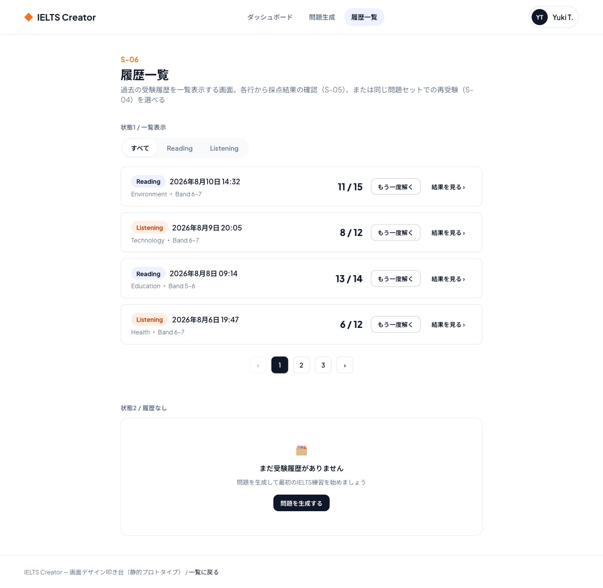

# S-06 履歴一覧画面

- 更新日: 2026-08-10（ビジュアルデザインを確定し反映、backend API設計の確定に伴いクエリパラメータ・レスポンス項目を反映）
- 関連文書: [画面一覧](../画面一覧.md) / [backendリポジトリ docs/API設計書/GET_attempts.md](https://github.com/h-fujiwara-dev/ielts-creater-backend/blob/main/docs/API設計書/GET_attempts.md) / [ielts-createrリポジトリ tickets/00016 画面デザイン叩き台の作成](https://github.com/h-fujiwara-dev/ielts-creater/blob/main/tickets/00016_画面デザイン叩き台の作成（ベーススタイル・主要フロー6画面）.md)

## 画面概要

過去の受験履歴を一覧表示する画面。ログイン必須。一覧の各行から、採点結果・解説を再確認する（結果画面 S-05へ）か、同じ問題セットをもう一度解く（回答画面 S-04へ）かを選択できる。

ビジュアルデザインは[#00016](https://github.com/h-fujiwara-dev/ielts-creater/blob/main/tickets/00016_画面デザイン叩き台の作成（ベーススタイル・主要フロー6画面）.md)で検討し確定した。

## ビジュアルデザイン

### レイアウト

上部にセクション絞り込みタブ（すべて/Reading/Listening）、下部に受験履歴のリスト行を縦に並べる。各行は日時・セクションバッジ・トピック/難易度・スコアを左寄せ、「もう一度解く」（アウトラインボタン）と「結果を見る」（テキストリンク）の2アクションを右寄せで配置する。下部にページング、履歴が0件の場合は空状態（アイコン＋案内文＋問題生成への導線）を表示する。

## 画面構成要素

| 要素 | 内容 |
| --- | --- |
| 受験履歴一覧 | 受験日時（`submittedAt`）、セクション（`section`）、スコア（`rawScore` / `maxScore`） |
| セクション絞り込み | Reading / Listening / すべて を切り替えるUI |
| ページング | ページ送りUI（`page` / `totalPages`） |
| もう一度解くボタン | 一覧の各行に配置。選択した受験と同じ問題セットで新たな受験を開始する |

## ワイヤーフレーム（デザイン叩き台 スクリーンショット）

静的HTML叩き台（デスクトップ幅1440px）のフルページスクリーンショット。一覧表示・空状態の2状態を1ページに並べて確認できるようにしている。

モバイル幅（375px相当）でも横スクロールなしで表示崩れがないことを確認済み。

## 入力項目とバリデーション

| 項目 | 種別 | 必須 | バリデーション |
| --- | --- | --- | --- |
| セクション絞り込み | 単一選択 | 任意（未選択時は全件） | `READING` / `LISTENING` / 指定なし |
| ページ番号 | ページング操作 | - | `0`以上の整数（`totalPages`を超えない） |

## 状態・画面遷移

| 操作/状態 | 遷移先・表示 | 条件・備考 |
| --- | --- | --- |
| 画面初期表示 | 一覧を表示（1ページ目、絞り込みなし） | `GET /api/v1/attempts`を呼び出す |
| セクション絞り込み変更 | 一覧を再取得して表示 | 絞り込み条件を付与して再呼び出し |
| ページ送り | 一覧を再取得して表示 | ページ番号を付与して再呼び出し |
| 一覧項目クリック（採点結果を確認） | S-05 結果画面（過去分） | 選択した`attemptId`で結果画面へ遷移する |
| もう一度解くボタン押下 | S-04 回答画面 | 選択した受験と同じ問題セット（`questionSetId`）で新たな受験（Attempt）を開始し、回答画面へ遷移する |

## API/データ連携

| API | 用途 | 備考 |
| --- | --- | --- |
| `GET /api/v1/attempts` | 受験履歴一覧の取得（ページング・絞り込み） | [API設計書](https://github.com/h-fujiwara-dev/ielts-creater-backend/blob/main/docs/API設計書/GET_attempts.md) |

## 実装メモ

- セクション絞り込みは`GET /api/v1/attempts?section=READING|LISTENING`のクエリパラメータで行う（未指定時は全件）
- レスポンスの各要素に`questionSetId`が追加されたため、結果画面（S-05）へのルーティング、および「もう一度解く」ボタンからS-04（`/practice/{questionSetId}`）への遷移のいずれも、本APIのレスポンスのみで完結する
- 一覧の対象は`status=SUBMITTED`のAttemptのみ（backend側で保証。`IN_PROGRESS`の未提出Attemptは表示されない）
