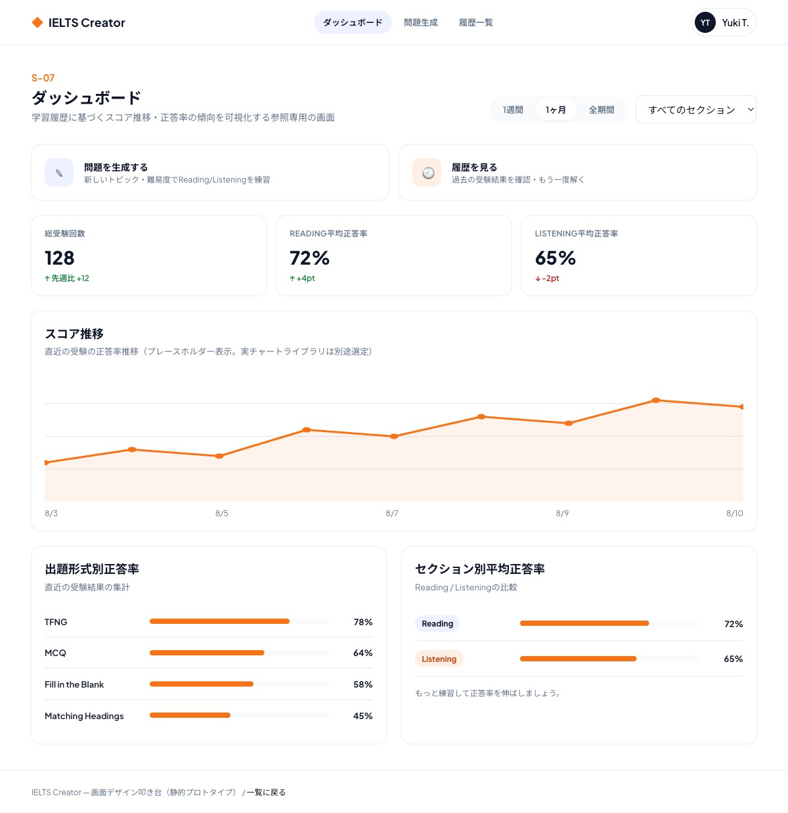

# S-07 ダッシュボード画面

- 更新日: 2026-08-10（ビジュアルデザインを確定し反映、期間・セクションフィルタのサーバー側実装を反映）
- 関連文書: [画面一覧](../画面一覧.md) / [backendリポジトリ docs/API設計書/GET_dashboard-summary.md](https://github.com/h-fujiwara-dev/ielts-creater-backend/blob/main/docs/API設計書/GET_dashboard-summary.md) / [ielts-createrリポジトリ tickets/00016 画面デザイン叩き台の作成](https://github.com/h-fujiwara-dev/ielts-creater/blob/main/tickets/00016_画面デザイン叩き台の作成（ベーススタイル・主要フロー6画面）.md)

## 画面概要

ログイン後の起点（ホーム）となる画面。学習履歴に基づくスコア推移・正答率の傾向を可視化するとともに、問題生成画面（S-03）・履歴一覧画面（S-06）への導線を提供するハブの役割を持つ。ログイン必須。

ビジュアルデザインは[#00016](https://github.com/h-fujiwara-dev/ielts-creater/blob/main/tickets/00016_画面デザイン叩き台の作成（ベーススタイル・主要フロー6画面）.md)で検討し確定した。

## ビジュアルデザイン

### レイアウト

上から、(1) 期間・セクションフィルタ（タブ＋セレクト）、(2) 「問題を生成する」「履歴を見る」のハブアクションカード2枚、(3) 総受験回数・Reading/Listening平均正答率の統計タイル3枚、(4) スコア推移チャート（折れ線、プレースホルダー実装。実チャートライブラリは実装時に選定）、(5) 出題形式別正答率・セクション別正答率のカード2枚、の順に配置する。

## 画面構成要素

| 要素 | 内容 |
| --- | --- |
| スコア推移グラフ | 日次等の時系列での正答率推移（`ScoreTrendChart.tsx`） |
| セクション別平均正答率 | Reading / Listening それぞれの平均正答率 |
| 出題形式別正答率 | TFNG / MCQ / FILL_BLANK / MATCHING_HEADINGS ごとの正答率 |
| 受験回数 | 総受験回数（`totalAttempts`） |
| 問題を生成するボタン | 問題生成画面（S-03）へ遷移する導線（新規に問題を解く） |
| 履歴を見るボタン | 履歴一覧画面（S-06）へ遷移する導線（過去の受験を確認・再受験する） |

## ワイヤーフレーム（デザイン叩き台 スクリーンショット）

静的HTML叩き台（デスクトップ幅1440px）のフルページスクリーンショット。

モバイル幅（375px相当）でも横スクロールなしで表示崩れがないことを確認済み。

## 入力項目とバリデーション

| 項目 | 種別 | 必須 | バリデーション |
| --- | --- | --- | --- |
| 期間フィルタ | 単一選択 | 任意 | `7D` / `30D` / `90D` / `ALL`（デフォルト`ALL`）。`period`クエリパラメータでサーバー側集計に反映 |
| セクションフィルタ | 単一選択 | 任意 | `READING` / `LISTENING` / 指定なし。`section`クエリパラメータでサーバー側集計に反映 |

## 状態・画面遷移

| 操作/状態 | 遷移先・表示 | 条件・備考 |
| --- | --- | --- |
| 画面初期表示 | 集計データを表示 | `GET /api/v1/dashboard/summary`を呼び出す |
| 期間・セクションによる表示切り替え | 同一画面内で表示を更新 | 遷移なし。`period`/`section`クエリパラメータを付与して`GET /api/v1/dashboard/summary`を再呼び出しする |
| 「問題を生成する」ボタン押下 | S-03 問題生成画面 | 遷移のみ（APIコールなし） |
| 「履歴を見る」ボタン押下 | S-06 履歴一覧画面 | 遷移のみ（APIコールなし） |

## API/データ連携

| API | 用途 | 備考 |
| --- | --- | --- |
| `GET /api/v1/dashboard/summary` | ダッシュボード集計データ取得 | [API設計書](https://github.com/h-fujiwara-dev/ielts-creater-backend/blob/main/docs/API設計書/GET_dashboard-summary.md) |

## 実装メモ

- 期間・セクションによる表示切り替え（F-11）はサーバー側フィルタで実現する。フィルタUI操作の都度、`period`/`section`クエリパラメータを付与して`GET /api/v1/dashboard/summary`を再呼び出しする
